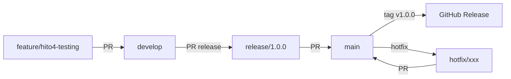

# Estrategia GitHub — TravelDiaryBis

## 1. Estructura de Ramas (Git Flow 2026)

### Rama perpetua (protegida)
```
main                  # Producción — solo merges vía PR con review + CI verde
develop               # Integración — destino de feature branches
```

### Ramas de soporte
```
feature/<hito>-<nombre>    # features/mejoras (origen: develop → destino: develop)
release/<version>          # preparación de release (origen: develop → destino: main + develop)
hotfix/<descripcion>       # corrección urgente en producción (origen: main → destino: main + develop)
```

**Reglas de protección en `main`:**
- Requerir PR con al menos 1 approval
- Requerir CI passing (GitHub Actions)
- Requerir branches actualizadas (evitar merge conflicts silenciosos)
- No push directo — solo merges vía PR

## 2. Flujo de Trabajo (Workflow)



### 📥 Pull Request Template
Cada PR debe incluir:
- **Descripción**: qué y por qué
- **Checklist**: pruebas, lint, tipo de cambio
- **Capturas** (si aplica cambios UI)

## 3. CI/CD Pipeline (GitHub Actions)

| Evento | Jobs |
|--------|------|
| `push` a `feature/*` | lint + detekt + unit tests |
| `push` a `develop` | lint + detekt + unit tests + instrumented tests (emulator) |
| `PR` hacia `main` | lint + detekt + all tests + build APK release |
| `push` tag `v*` | build AAB release + publish to Play Console (future) |

### Herramientas de calidad
- **Detekt** — análisis estático + code smells
- **ktlint** — formato Kotlin consistente
- **JUnit 5 + MockK** — unit tests (ViewModels, UseCases, Repository)
- **Compose Test** — UI tests (flujos críticos)

## 4. Subagentes y Asignación de Tareas

| Rol | Agente | Responsabilidad |
|-----|--------|----------------|
| **Architect** | Clean Architecture + DI | Refactorizar a casos de uso, asegurar inyección Hilt correcta, estructura de paquetes |
| **DataSpec** | Persistencia y Datos | Migraciones Room, TypeConverters, repositorios, manejo de errores |
| **UIGuardian** | UI/UX Compose | Material 3, estados sealed, animaciones, accesibilidad, dark mode |
| **QA-Droid** | Calidad y Testing | Unit tests, UI tests, detekt, ktlint, CI pipeline |

## 5. Hitos y Milestones (2026 Q3-Q4)

### Hito 4 — Testing y Calidad (Sprint 1-2)
- [ ] Unit tests: HomeViewModel, AddEntryViewModel, DetailViewModel
- [ ] UI tests: flujo Camera → AddEntry → Home
- [ ] Integrar Detekt + ktlint en CI
- [ ] Configurar GitHub Actions

### Hito 5 — UX Premium (Sprint 3-4)
- [ ] Shared Element Transitions entre pantallas
- [ ] Dark Mode pulido
- [ ] Micro-interacciones (haptic, animations)
- [ ] Offline-first con error handling visual

### Hito 6 — Enriquecimiento (Sprint 5-6)
- [ ] Vista de mapa con pins (MapLibre / Google Maps)
- [ ] Geoetiquetado automático
- [ ] Exportar recuerdo a imagen/PDF

## 6. Convenciones de Commits (Conventional Commits 2026)

```
feat: añadir pantalla de mapa con clustering de pins
fix: corregir crash al rotar en CameraScreen
refactor: extraer lógica de permisos a helper
test: añadir unit tests para AddEntryViewModel
ci: configurar GitHub Actions con Detekt
chore: actualizar dependencias Room a 2.7.0
```

## 7. Primeros Pasos (Ejecución Inmediata)

1. Crear rama `develop` desde `main`
2. Hacer commit de los cambios actuales (Hilt + mejoras) en `develop`
3. Crear rama `feature/hito4-testing` para testing
4. Configurar GitHub Actions
5. Proteger rama `main` en GitHub (Settings → Branches)
6. Borrar la branch remota legacy `feature/clean-architecture-refactor`

---

*Documento generado siguiendo estándares de desarrollo mobile Android 2026*
